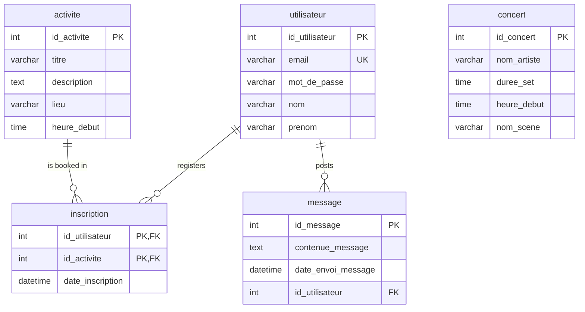

<div align="center">
 
# MyFestival
 
### Your pocket companion for the whole festival weekend 🎶
 
Browse the line-up, sign up for activities, and chat with other festival-goers — all from one app.
 


 
*BTS SIO · First transversal project*
 
</div>
---
 
##  What is it?
 
**MyFestival** is a small full-stack web app that acts as the digital hub of an open-air music festival. Visitors can preview the concert line-up without an account, then sign up to unlock the activity programme, register for the events they like, and jump into the festival chat.
 
No framework, no build step — just plain **PHP**, **MySQL** and **CSS**, the way a server-rendered app was meant to be. 
 
---
 
##  Features
 
| | Feature | Description |
|---|---|---|
|  **Accounts** | Sign up, log in, log out and manage your profile. |
|  **Concert line-up** | The full bill — artists, stages (*Scène Principale*, *Le Dôme*, *Scène Forêt*) and set times. Open to everyone. |
|  **Activities & sign-up** | Once logged in: morning yoga, pétanque tournament, mocktail workshop, treasure hunt, giant blind-test, slackline… one click to register. |
|  **Community chat** | Talk to other festival-goers. Guests get a read-only preview. |
 
---
 
##  Tech stack
 
- **Backend** — PHP 8.3 with PDO
- **Database** — MySQL 9.1
- **Frontend** — server-rendered HTML + vanilla CSS
- **Auth** — PHP sessions
- **Tooling** — phpMyAdmin for the database
---
 
##  Database
 
Five tables power the app: users, the concert bill, the activity catalogue, the many-to-many sign-ups, and the chat messages.
 

 
---
 
## 📁 Project structure
 
```
My_Festival/
├── Acceuil.php                  #  Home — concert line-up + activity feed
├── Login.php                    #  Login
├── Cre.compte.php               #  Sign-up
├── Deconnexion.php              #  Logout
├── Utilisateur.php              #  User account
├── page_activite.php            #  Activity page / registration
├── chat.php                     #  Community chat (members)
├── user_non_connecter_chat.php  #  Chat preview (guests)
├── db_connexion.php             #  PDO database connection
├── myfestival_db.sql            #  Schema + seed data
├── General.css                  #  Global styles
├── chat.css                     #  Chat styles
├── background.jpg               #  Background
└── photo_concert/               #  Concert photos
```
 
---
 
##  Getting started
 
> **Requirements:** PHP 8+, MySQL (or MariaDB). XAMPP / WAMP / MAMP work great.
 
```bash
# 1. Clone the repo
git clone https://github.com/Brian-Emp/My_Festival.git
cd My_Festival
 
# 2. Import the database (creates myfestival_db + seed data)
mysql -u root -p < myfestival_db.sql
 
# 3. Set your DB credentials in db_connexion.php
 
# 4. Run it
php -S localhost:8000
```
 
Then open 👉 **http://localhost:8000/Acceuil.php**
 
*(Or drop the folder into your `htdocs` / `www` directory and let Apache serve it.)*
 
###  Demo data
 
The SQL dump ships with sample content so you can try it instantly — a handful of concerts, the full activity catalogue, and three test users: `alice@festival.com`, `bob@festival.com`, `charlie@festival.com`.
 
---
 
##  Ideas for later
 
-  Switch password storage to `password_hash()` / `password_verify()`
-  Make the layout fully responsive
-  Filter the line-up by stage or time slot
-  A personal **"My schedule"** page built from your sign-ups
---
 
<div align="center">
Made by [**Brian**](https://github.com/Brian-Emp)
 
</div>
 
